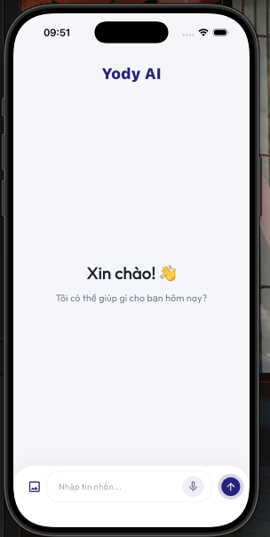
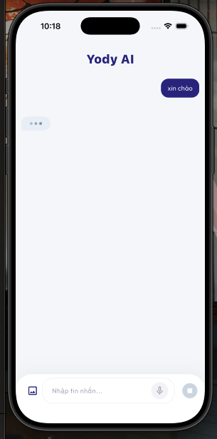
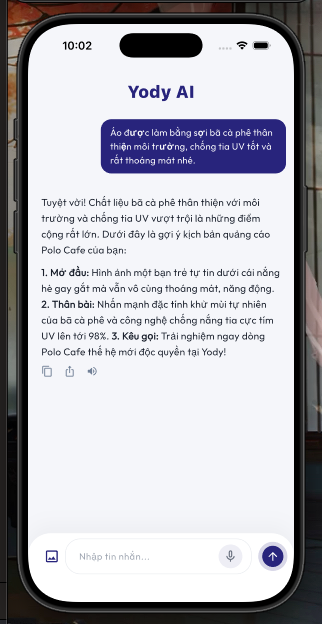
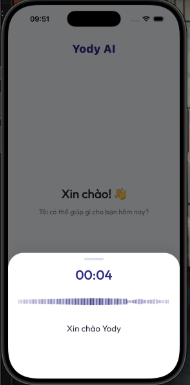
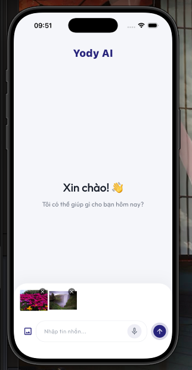

# 🤖 Yody AI Chat Flutter Template

A premium, standalone, and highly customizable **AI Chat** mobile template designed for seamless integration into any Flutter application. It leverages flexible runtime environments via `.env` (flutter_dotenv), features robust real-time voice recognition with animated audio visualizer waves, and provides a polished, glassmorphism-inspired user interface.

---

## 📸 App Screenshots

Below are some actual screenshots of the application running on iOS simulators:

<p align="center">
  
  &nbsp;&nbsp;&nbsp;&nbsp;
  
  &nbsp;&nbsp;&nbsp;&nbsp;
  
</p>
<p align="center">
  
  &nbsp;&nbsp;&nbsp;&nbsp;
  
</p>

* **Top Left:** Minimalist chat home interface featuring premium *Outfit* typography and refined layout shadows.
* **Top Center:** Active AI Generating state showing the animated typing indicator (`...`) and the dynamic streaming Stop button in the composer bar.
* **Top Right:** Active rich chat conversation displaying advanced Markdown support, copy, share, and Text-to-Speech action buttons.
* **Bottom Left:** Advanced audio recording bottom sheet with real-time sound wave animations and live speech-to-text feedback.
* **Bottom Right:** Smooth media preview bar positioned elegantly above the message input field with simple delete controls.

---

## 🌟 Key Features

- **Zero-Dependency Architecture:** Completely decoupled from the original monorepo. It has zero dependencies on internal monorepo design systems, utilities, or databases, making it immediately reusable as an out-of-the-box template.
- **Premium Design Aesthetics:** Features the sophisticated `CustomColors` palette, gorgeous Google Fonts *Outfit* typography, fine micro-animations, and responsive haptic feedback.
- **Flexible Environment Configuration (`flutter_dotenv`):** Easily control your WebSocket gateways, HTTP API gateways, internal signatures, and other features entirely from a local `.env` file without committing secrets.
- **Smart Message ListView (`CustomList`):** Employs scroll-listeners to handle auto-pagination and optimized reversed lists for chat histories.
- **Rich Media Support:** Integrated camera and gallery image-picker support with simple attachment previews.
- **Delta Text Streaming with Markdown:** Supports real-time text streaming via WebSocket delta events, dynamically rendering complex Markdown syntax (headings, lists, bold formatting, etc.) on the fly as messages load.
- **Interactive Message Quick Actions:** Each assistant response bubble is equipped with intuitive action tools:
  - **Copy to Clipboard:** Instantly copy response content with a single tap.
  - **Native Sharing:** Share responses directly using device-native sharing sheets.
  - **Localized Text-to-Speech (TTS):** Read messages aloud using an advanced TTS engine with automatic language detection (seamlessly switching between Vietnamese and English voice profiles for correct pronunciation).

---

## 🛠 Prerequisites

* **FVM (Flutter Version Manager):** Bound to Flutter SDK `3.44.0` (Stable)
* **Dart SDK:** `>=3.12.0 <4.0.0`
* **CocoaPods:** Post-install permission macros pre-configured for iOS.

---

## 🚀 Setup & Launch Guide

### Step 1: Initialize the `.env` Configuration
Create a `.env` file in the root directory of your project. **Important:** Never push the `.env` file or raw security tokens to public repositories. Use placeholders as template models:

```env
# Yody AI Chat Environment Configuration
AI_CHAT_API_URL=https://your-api-gateway.domain.com/
AI_CHAT_WS_URL=wss://your-websocket-gateway.domain.com/ws/
AI_CHAT_INTERNAL_TOKEN=YOUR_INTERNAL_SIGNATURE_TOKEN_HERE
AI_CHAT_AUTH_TOKEN=YOUR_USER_ACCESS_TOKEN_HERE
AI_CHAT_SHOW_IMAGE=true
```

### Step 2: Launch the Project
Run the following commands in your workspace terminal to download dependencies and boot up the project:

```bash
# Download required packages
fvm flutter pub get

# Launch the app on your connected device/simulator
fvm flutter run
```

---

## 📦 Directory Structure

This project follows a clean, modern layered architectural structure:

```text
lib/
├── config/
│   └── ai_chat_config.dart          # Reads environmental variables and binds runtime callbacks
├── core/
│   ├── services/
│   │   ├── network_service.dart     # HTTP REST Service wrapper around Dio
│   │   ├── shared_storage.dart      # Local Storage controller wrapping SharedPreferences
│   │   └── speech_helpers.dart      # Text-to-Speech utility service
│   ├── theme/
│   │   └── custom_colors.dart       # Design system colors, fonts, and dimensions
│   └── widgets/
│       ├── custom_text.dart         # Standard typography widget wrapper
│       ├── custom_textfield.dart    # Self-contained premium text field component
│       └── custom_list.dart         # Smart paginated scroll list wrapper
├── features/
│   ├── audio/                       # Microphone services, Speech-to-Text cubits, and visualizer views
│   └── home/                        # Chat layout pages, composer bars, and chat stream BLoCs
├── router/
│   └── ai_chat_router.dart          # Screen routing paths mapped using GoRouter
└── main.dart                        # Application entryway initializes .env
```

---
